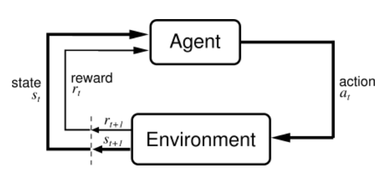

# Introduce of ReinforceReinforcement Learning
Reinforcement learning is learning what to do—how to map situations to actions—so as to maximize a numerical reward signal.

**A complete, interactive goal-seeking agent, explores and learn from enviorment.**

---

## Main subelements of RL system

- Policy: A **mapping** from perceived states of the environment to actions to be taken when in those states.
- Reward: The **signal** that defines the goal of a reinforcement learning problem, indicates what is good in an immediate sense
- **Value function**: Specifies what is **good in the long run**. Action choices are made based on value judgments.
- Model of the environment: allows **inferences** to be made about how the environment will behave.

---
## Jetcar Example
- Agent: the car
- Enviroment: Runway and the rewards it given: $r \in \mathcal{R}$, 0 for runing, -1 for touch the obstcles.
- Action Space: $a\in \mathcal{A}$, Throttle and steering control.
- State: $s \in \mathcal{S}$, the poistion on the runway, with the speed of the car $S_t \dot{=} (x, y, v_x, v_y)$.
- Policy: $\pi(a|s)$, What the control should be given under specific car state $S_t$?
- Value Functions: $v_\pi(s)$, what is the total reward the car will gain after take specific action under state $s$?

---

## Features of reinforcement learning
- trial-and-error search
- delayed reward

## Markov decision Processes
$$
p(s', r|s, a) \dot{=} Pr\{ S_t=s', R_t = r | S_{t-1}=s, A_{t-1} = a \}
$$

**MDPs** model sequential decision making in which actions influence **immediate rewards** and **future states**.

---

## Bellman Equation
$$
v_\pi(s) \dot{=} \sum_a{\pi(a|s)} \sum_{s', r}p(s', r|s, a)[r+\gamma v_\pi(s')]
$$

---

---

# Model-Based algorithms
## Dynamic Prohramming

---

# Model-Free algorithms

## Value-Based

---

## Policy-Based

---

### Q-Learning

---

---